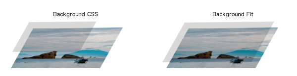

#jQuery Plugin Background Fit

Background Fit is a jQuery plugin that appear in sizes that fit to the aspect ratio of the background image.




##Demo

Demo is Comparison of jquery.background-fit.js and the background css.

[Demo](http://project.thingslabo.com/jquery.background-fit/examples/)

##Usage

1. Setting the jQuery
2. Setting the jquery.background-fit.js
3. Prepare for HTML and background image, CSS
4. Run the script
5. Operation checking

###1. Setting the jQuery

jQuery (>= 1.11 Or >= 2.x) loaded in your page. 

Download the jQuery from jquery.com. Or set the jQuery that is delivered from the CDN.

[Download jQuery](http://jquery.com/download/)

###2. Setting the jquery.background-fit.js


jquery.background-fit.js loaded in your page. 

Download the jquery.background-fit.min.js. Set the script tag to HTML, like this:

```html
<script src="http://DOMAIN/PATH/TO/jquery.background-fit.min.js"></script>
```

###3. Prepare for HTML and background image, CSS

Provide the HTML to display the background image. By setting the class attribute or id attribute. Attribute name to your liking.

```html
<div id="bg">jquery.background-fit.js</div>
```


Set the background image on the CSS.

```css
<style>
#bg {
	background: url(http://DOMAIN/PATH/TO/sample.jpg);
	background-size: 100%;
	background-repeat: no-repeat;
}
</style>
```

If set the width, it will display the display size has been adjusted.

```css
<style>
#bg {
	background: url(http://DOMAIN/PATH/TO/sample.jpg);
	background-size: 100%;
	background-repeat: no-repeat;
    width: 300px;
    height: 300px;
}
</style>
```

###4. Run the script

Write JavaScript to run the Background Fit. 
Apply a Background Fit by specifying the selector to the class attribute or an id attribute set to HTML. Run the script like so:

```javascript
<script>
$(function() {
  $("#bg").bg_fit();
});
</script>
```

###5. Operation checking

Checking the display.

Have fun!


##Required

jQuery 1.11+ Or jQuery 2.x+
 [http://jquery.com/download/](http://jquery.com/download/)

##Changelog

* Version 0.0.4 - 2014-07-29
	* refactoring
* Version 0.0.3 - 2014-06-12
	* fix in case of multiple setting
* Version 0.0.2 - 2014-05-14
	* improve bgImg object
* Version 0.0.1 - 2013-02-13
	* Initial release.

##Sample image Provided by

[Ashinari Photo Material](http://www.ashinari.com)

##License

Dual licensed under the MIT and GNU General Public License v2.0 (GPLv2) licenses.

Copyright (c) 2013-2014 by thingsym

###The MIT License (MIT)

Permission is hereby granted, free of charge, to any person obtaining a copy
of this software and associated documentation files (the "Software"), to deal
in the Software without restriction, including without limitation the rights
to use, copy, modify, merge, publish, distribute, sublicense, and/or sell
copies of the Software, and to permit persons to whom the Software is
furnished to do so, subject to the following conditions:

The above copyright notice and this permission notice shall be included in
all copies or substantial portions of the Software.

THE SOFTWARE IS PROVIDED "AS IS", WITHOUT WARRANTY OF ANY KIND, EXPRESS OR
IMPLIED, INCLUDING BUT NOT LIMITED TO THE WARRANTIES OF MERCHANTABILITY,
FITNESS FOR A PARTICULAR PURPOSE AND NONINFRINGEMENT. IN NO EVENT SHALL THE
AUTHORS OR COPYRIGHT HOLDERS BE LIABLE FOR ANY CLAIM, DAMAGES OR OTHER
LIABILITY, WHETHER IN AN ACTION OF CONTRACT, TORT OR OTHERWISE, ARISING FROM,
OUT OF OR IN CONNECTION WITH THE SOFTWARE OR THE USE OR OTHER DEALINGS IN
THE SOFTWARE.

http://www.opensource.org/licenses/mit-license.php

###GNU General Public License v2.0 (GPLv2)

http://www.gnu.org/licenses/gpl.html
